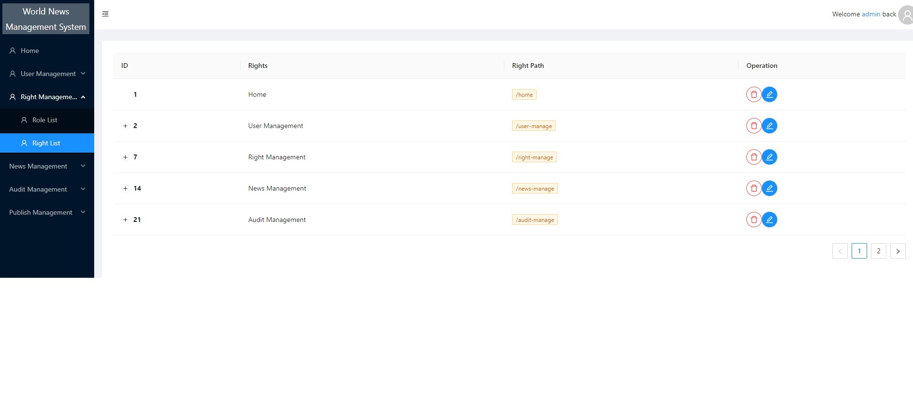

# News Management System

A web application is to manage news.

Developed with React.js, ant-design, testing-library.

### Key Features:

- Login/logout
- User management
  - Add a user
  - Delete a user
  - Edit a user
- Right management
  - Delete a role item
  - Edit a role item
  - Delete a right item
  - Edit a right item
- News management
  - Add a news
  - Delete a news
  - Edit a news
  - Add a news category
  - Delete a news category
- Audit management
- Publish management
  - Publish a news
  - Sunset a news
- Guest mode
- Data analysis




### Getting Started

##### start json-server
```shell
json-server --watch .\db.json --port 5000  
```

##### Start the app
```shell
npm start
```

Open [http://localhost:3000](http://localhost:3000) with your browser to see the result.

##### Admin Info
```shell
user: admin
password: 1234
```
